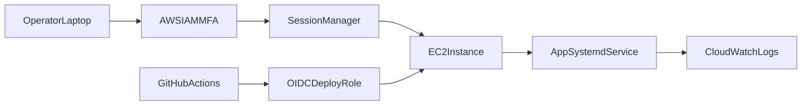

# AWS VPS Remote Management Plan

## Target operating model
- Deploy app on a hardened AWS EC2 instance (your VPS) with systemd-managed process/runtime.
- Manage remotely through a safer control plane (AWS SSM Session Manager and/or Tailscale/Cloudflare Access), with SSH as break-glass only.
- Use CI/CD (GitHub Actions) for deterministic deploys, and CloudWatch for logs/alerts.

## Professional remote access architecture
- **Primary admin access:** AWS Systems Manager Session Manager (no inbound SSH port required).
- **Optional browser/admin access:** Zero-trust tunnel layer (Tailscale or Cloudflare Access) for app/admin endpoints.
- **Break-glass:** restricted SSH from fixed IP + key-only auth + MFA on IAM.
- **Secrets:** AWS SSM Parameter Store (SecureString) or AWS Secrets Manager; never store runtime secrets in repo/artifacts.

## Phase 1: Production-ready EC2 baseline
- Provision EC2 (Ubuntu LTS), attach IAM role for SSM + CloudWatch Agent, and allocate Elastic IP.
- Security group:
  - allow `80/443` from internet (or from tunnel origin only),
  - deny inbound `22` initially (or allow from single trusted IP if break-glass needed).
- Install runtime deps (Node LTS, Playwright deps, Chromium libs), create non-root service user, and set file permissions for project and artifact paths.

## Phase 2: Runtime + process management
- Deploy app code under a fixed directory (for example `/opt/marketing-automation`).
- Configure systemd service for app startup/restart policy and environment file path.
- Add environment source from SSM/Secrets at deploy/start time.
- Add health check endpoint integration and restart hooks.

## Phase 3: Remote access and operations
- Enable SSM Session Manager as standard remote shell path.
- Optionally add Tailscale/Cloudflare Access for web/admin reachability with SSO and policy controls.
- Keep SSH disabled by default; document temporary emergency enable/disable runbook.

## Phase 4: Observability and safety
- Ship app/service logs to CloudWatch Logs with retention policy.
- Add CloudWatch alarms (service down, repeated restart loops, high error rate).
- Capture and rotate app artifacts on instance; define retention/cleanup policy for `artifacts/`.
- Add regular backup/snapshot policy for stateful files (`artifacts/publisher-history.json`, runtime controls).

## Phase 5: CI/CD (professional workflow)
- Add GitHub Actions pipeline:
  - lint + integration tests gate,
  - build package,
  - deploy via OIDC-assumed AWS role (no long-lived AWS keys).
- Deploy strategy: atomic release directory + symlink switch + systemd restart + smoke check + rollback.

## Phase 6: Session handover update (end-of-session deliverable)
- Create a new handover JSON in [`/parent/marketing-automation/.agent/session-handovers`](/parent/marketing-automation/.agent/session-handovers) following existing structure (objective, current_state, constraints, next_actions, artifacts_touched).
- Include explicit “next operational steps” for AWS provisioning, secure remote access, secrets migration, and CI/CD bootstrap.
- Update state index reference if this repo workflow requires it.

## Concrete next actions for the next coding session
- Add infra/runbook docs under repo (deploy, SSM access, break-glass procedure).
- Add systemd unit + env loading script templates.
- Add deploy workflow (GitHub Actions + AWS OIDC role usage).
- Add handover file capturing finished work, pending items, and acceptance checks for remote ops readiness.
