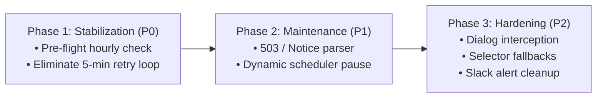

# Auto-Publisher Maintenance Window & Hourly Rate-Limit Failure Assessment

## 1. Executive Summary

This assessment evaluates two interconnected production challenges affecting the automated forum publisher (`ppomppu-gonggu-v1` workflow on Ppomppu):

1. **Platform Maintenance Windowing ("점검 중 입니다"):**
   During scheduled or emergency platform maintenance (e.g. HTTP 503 with Korean notices such as "뽐뿌 시스템 점검 중입니다"), the system lacks the ability to identify maintenance status, parse the announced time window, and dynamically pause publishing activities. Instead, it classifies the event as a critical observer failure (`BOARD_ACCESS_DENIED`), generates alarming Slack notifications, and continues attempting executions throughout the downtime.
2. **Hourly Rate Limit (1-Post-Per-Hour Rule) & The 5-Minute Retry Storm:**
   Ppomppu enforces a strict policy permitting only **one post within the same hour** (60-minute rolling cooldown). However, the auto-publisher scheduler is fundamentally **gap-driven** (triggering whenever competitor activity pushes the board gap above threshold). When the board gap remains safe shortly after a post, or when a publishing run fails due to rate limits or unhandled dialogs, the scheduler enters an aggressive **5-minute retry loop** (`PUBLISHER_FAIL_RECHECK_INTERVAL = 5`). This causes up to 12 failing browser runs per hour, triggering repeated playbook errors (`[Playbook] open-saved-drafts: no matching selector candidate`), spamming Slack channels, and increasing the risk of IP/account bans.

This document analyzes the components involved, details the core technical challenges, compares architectural solutions, and outlines an actionable implementation roadmap with estimated effort.

---

## 2. Log Evaluation & Incident Timeline Breakdown

A chronological breakdown of analyzed publisher executions illustrates the exact mechanics of both issues:

| Timestamp | Result | Decision | Key Log / Diagnostic Detail | Analysis & System Behavior |
| :--- | :--- | :--- | :--- | :--- |
| **08/18 15:23:58** | **FAIL** | `publisher_error` | `locator.click: Timeout 500ms exceeded` (Draft row) | Modal action timeout during transition. |
| **08/18 15:29:21** | **OK** | `published_verified` | Verified post `2acc7dc5…` | Successful publication. 60m cooldown begins. |
| **08/18 16:37:45** | **OK** | `published_verified` | Verified post `84838f82…` | 68 min since last post. Successful publication. |
| **08/18 17:02 – 17:34** | **FAIL** | `publisher_error` | `[Playbook] open-saved-drafts: no matching selector candidate` | **5-minute retry storm (7 attempts in 32 min):** 17:02, 17:08, 17:13, 17:18, 17:23, 17:28, 17:34. Gap was safe, but <60m elapsed since 16:37. Write button click blocked by rate limit; alert dismissed; draft button absent on redirected page. |
| **08/18 17:39:31** | **FAIL** | `publisher_error` | `locator.click: Timeout 500ms exceeded` | 62 min elapsed; write form opened, but draft row click timed out. |
| **08/18 17:44:53** | **OK** | `published_verified` | Verified post `d4814e77…` | Successful publication (67 min since 16:37). |
| **08/18 18:03 – 18:40** | **FAIL** | `publisher_error` | `[Playbook] open-saved-drafts: no matching selector candidate` | **5-minute retry storm (8 attempts in 40 min):** 18:03, 18:08, 18:14, 18:19, 18:24, 18:29, 18:35, 18:40. Repeatedly blocked by 1-hour rule; 5m fallback repeatedly triggered. |
| **08/18 18:45:42** | **OK** | `published_verified` | Verified post `fdf56e65…` | Successful publication (61 min since 17:44). |
| **08/18 19:47:54** | **OK** | `published_verified` | Verified post `4110c885…` | Successful publication (62 min since 18:45). |
| **08/18 20:28 – 20:39** | **FAIL** | `publisher_error` | `[Playbook] open-saved-drafts: no matching selector candidate` | 3 attempts in 11 min (20:28, 20:34, 20:39). Blocked by 1-hour rule (only 40 min since 19:47). |
| **08/18 20:45:19** | **FAIL** | `observer_error` | `page.goto: Timeout 30000ms exceeded` | Ppomppu server latency preceding maintenance window. |
| **08/18 21:51:24** | **FAIL** | `observer_error` | `BOARD_ACCESS_DENIED: status=503 title="뽐뿌 시스템 점검 중입니다."` | **Platform server maintenance window active.** Unhandled 503 treated as critical error. |
| **08/19 01:50:55** | **OK** | `published_verified` | Verified post `7b00399b…` | Maintenance completed. Pipeline resumed successfully. |

---

## 3. Components Involved & Interaction Architecture

The issue spans several distinct modules across the marketing-automation stack:

```mermaid
flowchart TD
    Scheduler["Scheduler (lib/scheduler/run.ts)"] -->|tick()| PublisherRun["Publisher Run (lib/publisher/publisherRun.ts)"]
    PublisherRun -->|1. Pre-flight Gap Check| Observer["Observer Run (lib/observer/observerRun.ts)"]
    Observer -->|Diagnostics| BoardDiag["Board Diagnostics (lib/observer/boardDiagnostics.ts)"]
    PublisherRun -->|2. Pre-flight Rate Limit Check| PubHistory["Publisher History (lib/publisherHistory.ts)"]
    PublisherRun -->|3. Browser Flow| Flow["Publisher Flow (lib/publisher/flow/runPublisherFlow.ts)"]
    Flow -->|Rate Limit Check| RateLimit["Rate Limit Detector (lib/publisher/ui/rateLimit.ts)"]
    Flow -->|Execute Playbook| Playbook["Playbook Runner & Manifest (manifest/playbook.json)"]
    Flow -->|State Update| State["State Management (lib/state/publisher.ts)"]
    PublisherRun -->|Notification Dispatch| Slack["Slack Notifications (lib/notifications.ts)"]
```

### 3.1 Observer Layer (`lib/observer/boardDiagnostics.ts`, `observerRun.ts`)
- **Current State:** `getBoardDiagnostics` extracts page `title`, `rowCount`, `writeButtonCount`, and `bodyText`. It only evaluates `isForbidden` (checking for HTTP 403). When an HTTP 503 status code is returned, `observerRun.ts` throws `BOARD_ACCESS_DENIED: status=503`.
- **Deficiency:** Maintenance notices (HTTP 503/502 or titles matching `"시스템 점검 중입니다"`) are not recognized as a structured operational state. Date/time schedules inside the maintenance notice are ignored.

### 3.2 Rate Limit Detection Layer (`lib/publisher/ui/rateLimit.ts`, `runPublisherFlow.ts`)
- **Current State:** `detectRateLimit` scans body text for a rigid string: `"글 등록 후 60분이 지나야 다음 게시물을 등록할 수 있습니다"`.
- **Deficiency:** When clicking the write button triggers a JavaScript `alert()` dialog or an immediate `history.back()` redirect, Playwright automatically dismisses the dialog. The browser returns to the board list where `RATE_LIMIT_MARKER` does not exist. The flow proceeds to step `open-saved-drafts` and crashes because the draft button is not present on the board list.

### 3.3 Scheduler Engine (`lib/scheduler/run.ts`)
- **Current State:** Designed to be "gap-driven." After a publish or when a publish attempt fails while the board gap is safe (`gapDiff <= 0`), the scheduler sets:
  ```typescript
  const PUBLISHER_FAIL_RECHECK_INTERVAL = 5;
  baseMinutes = PUBLISHER_FAIL_RECHECK_INTERVAL;
  nextMinutes = PUBLISHER_FAIL_RECHECK_INTERVAL;
  ```
- **Deficiency:** When a publish fails due to a rate limit or playbook error, the scheduler retries in **5 minutes**, completely ignoring `publishBlockedUntil`, the 60-minute hourly limit, or platform maintenance windows.

### 3.4 Runtime State & Persistence (`lib/state/publisher.ts`, `persistence.ts`)
- **Current State:** Tracks `publishBlockedUntil` and `draftItemIndex` in memory and persists to `runtime-controls.json`.
- **Deficiency:** Lacks a dedicated `maintenanceBlockedUntil` timestamp, and `publishBlockedUntil` is cleared prematurely or bypassed during gap-safe failure retries.

### 3.5 Notification Subsystem (`lib/notifications.ts`, `publisherRun.ts`)
- **Current State:** Formats any non-success decision other than `gap_policy` as a critical failure:
  `❌ *Publisher Failed* [decision]`.
- **Deficiency:** Both expected rate-limit backoffs and external platform maintenance trigger alarming `❌` alerts, causing severe operator alert fatigue.

---

## 4. Technical Challenges on Hand

### Challenge 1: Unstructured Korean Maintenance Text Parsing & Dynamic Resume Scheduling
- **Context:** Korean web platforms format maintenance notices in varied text patterns:
  - `점검 시간 : 2026년 08월 18일 21:00 ~ 23:00`
  - `작업 일시 : 2026.08.18 21:00 ~ 23:00 (약 2시간)`
  - `점검시간: 02:00 ~ 06:00` (time only)
  - `시스템 점검 중입니다. 이용에 불편을 드려 죄송합니다.` (no end time provided)
- **Difficulty:** The parser must reliably extract start and end dates/times across varied date formats, handle single-day vs multi-day ranges, compute UTC timestamps relative to Korea Standard Time (UTC+9), add a safety buffer (e.g. +5 minutes), and gracefully fall back to a sensible default duration (e.g. 30–60 minutes) if no time is detected.

### Challenge 2: Browser Dialog vs DOM Inspection Race Condition
- **Context:** When Ppomppu blocks a user from accessing `write.php` due to rate limiting:
  1. It may render an HTML page containing rate-limit text.
  2. Or it may render an inline script: `<script>alert("글 등록 후 60분이 지나야..."); history.back();</script>`.
- **Difficulty:** If it uses `alert()`, Playwright's default behavior auto-dismisses dialogs. By the time `detectRateLimit(page)` inspects `page.textContent("body")`, the browser has already navigated back to the board list. The detector must listen to `page.on('dialog')` *before* the click occurs to capture the message text and cancel the remaining playbook steps cleanly.

### Challenge 3: Decoupling Gap-Driven Scheduling from Rate-Limit & Maintenance Constraints
- **Context:** The core value proposition of the system is gap-driven scheduling: publish as soon as competitor posts exceed the safety gap.
- **Difficulty:** On high-volume boards, the gap threshold (e.g. 4 posts) can be reached in 5–15 minutes. However, the external platform enforces a hard 60-minute limit. The scheduler must reconcile these conflicting principles:
  - Never attempt a publish if `timeSinceLastPublish < 60 minutes`.
  - Never enter a 5-minute retry loop when an attempt fails due to rate limits or maintenance.
  - Automatically calculate and wait for the exact remaining cooldown.

### Challenge 4: Zero-Overhead Proactive Throttling
- **Context:** Currently, checking whether a rate limit applies requires launching Chromium, loading cookies, navigating to the board, and clicking "글쓰기" — taking 10–25 seconds and consuming significant CPU/RAM.
- **Difficulty:** Executing full browser runs every 5 minutes just to check if the rate limit has expired wastes resources and leaves aggressive bot footprints on the platform. The solution must determine eligibility **before** launching Chromium by inspecting persistent publication history.

---

## 5. Available Solutions & Trade-off Analysis

| Solution Approach | Description | Advantages | Disadvantages / Risks | Recommendation |
| :--- | :--- | :--- | :--- | :--- |
| **Option A: Purely Reactive (In-Browser)** | Keep current flow; expand regex in `rateLimit.ts` and catch dialogs; set `publishBlockedUntil` after clicking write. | Directly verifies platform response. | Spawns Chromium every 5 min; high resource usage; risks platform throttling. | **Not Recommended** |
| **Option B: Proactive History Gatekeeper Only** | Add pre-flight check in `publisherRun`: if `now - lastPublish < 60m`, abort immediately. | Zero browser launch; zero platform risk; fast execution. | Does not resolve the 5-minute scheduler loop or maintenance handling. | **Insufficient Alone** |
| **Option C: Integrated Comprehensive Lifecycle Architecture** | 1. **Proactive Gate:** Check `publisherHistory` before launching browser.<br>2. **Reactive Fallback:** Capture `dialog` and parse body for maintenance & rate limits.<br>3. **Scheduler Alignment:** Eliminate 5-min safe-gap loop for errors; schedule next tick at `max(maintenanceUntil, publishBlockedUntil, normalInterval)`.<br>4. **Alert Rationalization:** Informative Slack alerts (`🚧`) for maintenance and rate limits. | Completely eliminates 5-min retry storms; handles maintenance gracefully; saves server resources; clean Slack alerts. | Requires changes across 5 components. | **Strongly Recommended** |

---

## 6. Work Breakdown Structure & Estimated Effort

The recommended resolution (Option C) is broken down into modular, testable tasks:

### Task 1: Platform Maintenance Detection & Time Window Parser Engine
- **Files:** `lib/observer/boardDiagnostics.ts`, `lib/observer/observerRun.ts`
- **Scope:**
  - Add `isMaintenance: boolean`, `maintenanceNotice: string | null`, and `maintenanceUntil: string | null` to `BoardDiagnostics`.
  - Implement `parseMaintenanceWindow(bodyText, title, now)` supporting Korean datetime formats (`YYYY년 MM월 DD일 HH:mm ~ HH:mm`, `HH:mm ~ HH:mm`, etc.).
  - Recognize HTTP 503/502/504 as maintenance when title or body contains maintenance keywords.
  - Set default pause window (e.g. 30 minutes) if notice text does not specify an end time.
- **Effort:** 3.5 Hours / 2 Story Points

### Task 2: Maintenance State Persistence & Scheduler Pause Integration
- **Files:** `lib/state/publisher.ts`, `lib/state/types.ts`, `lib/scheduler/run.ts`
- **Scope:**
  - Add `maintenanceBlockedUntil: string | null` to `PublisherControls` with atomic disk persistence.
  - In `lib/scheduler/run.ts`: When `tick()` reports `system_maintenance` or `maintenanceBlockedUntil` is active, calculate remaining minutes + 2m buffer and set timer directly to resumption time.
  - Prevent any ticks or browser launches while maintenance is active.
- **Effort:** 2.5 Hours / 2 Story Points

### Task 3: Proactive Hourly Rate-Limit Guard (Pre-Flight Check)
- **Files:** `lib/publisher/publisherRun.ts`, `lib/publisher/ui/rateLimit.ts`
- **Scope:**
  - In `runPublisher()`: Before launching Playwright context, query `getPublisherHistory(1)` for the last `published_verified` entry.
  - If `now - lastPublishAt < 60 minutes`, skip browser execution.
  - Calculate exact remaining minutes, set `publishBlockedUntil`, and return `decision: 'rate_limited'` with `gapInfo: undefined`.
- **Effort:** 2.0 Hours / 1 Story Point

### Task 4: Scheduler 5-Minute Retry Storm Elimination
- **Files:** `lib/scheduler/run.ts`
- **Scope:**
  - Modify `scheduleNext()`: Remove unconditional `PUBLISHER_FAIL_RECHECK_INTERVAL = 5` when `gapDiff <= 0`.
  - If the run resulted in `rate_limited`, schedule next tick at `now + remainingMinutes + 1m`.
  - If the run failed with a general error (playbook/browser crash), apply progressive exponential backoff (15m -> 30m -> 60m) instead of a tight 5-minute loop.
- **Effort:** 3.0 Hours / 2 Story Points

### Task 5: Reactive Dialog Interception & Regex Expansion
- **Files:** `lib/publisher/flow/runPublisherFlow.ts`, `lib/publisher/ui/rateLimit.ts`
- **Scope:**
  - Attach `page.once('dialog')` before `click-write` step to capture alert messages like `"글 등록 후 60분이 지나야..."`.
  - Expand `RATE_LIMIT_MARKER` in `rateLimit.ts` to support regex matching variations (`/(?:60분|1시간)\s*(?:이내|이 지나야|에\s*1개)/i`).
- **Effort:** 2.0 Hours / 1 Story Point

### Task 6: Playbook Selector & Modal Action Timeout Hardening
- **Files:** `.planning/spec-kit/manifest/playbook.ppomppu-gonggu-v1.json`, `lib/publisher/ui/draftModal.ts`
- **Scope:**
  - Add anchor tag candidates (`a.btn_tempas`, `a:has-text("임시저장")`) to `open-saved-drafts` step.
  - Increase `DRAFT_MODAL_ACTION_TIMEOUT_MS` from 500ms/1000ms to 3000ms–5000ms.
- **Effort:** 1.0 Hour / 1 Story Point

### Task 7: Slack Alert Rationalization & Noise Reduction
- **Files:** `lib/publisher/publisherRun.ts`, `lib/notifications.ts`
- **Scope:**
  - For `system_maintenance`: Send a single informative `🚧 *Platform Maintenance Detected*` alert with expected resume time; suppress repeated alerts during the outage.
  - For `rate_limited`: Demote from `❌ *Publisher Failed*` to debug log or single quiet notification.
- **Effort:** 1.5 Hours / 1 Story Point

---

## 7. Summary of Effort & Sizing

| Category | Tasks Included | Estimated Hours | Story Points | Risk Level |
| :--- | :--- | :--- | :--- | :--- |
| **P0: Immediate Stabilization** | Task 3 (Proactive Hourly Guard) + Task 4 (Fix 5-Min Retry Storm) | 5.0 Hours | 3 SP | Low |
| **P1: Maintenance Management** | Task 1 (Maintenance Detection/Parser) + Task 2 (Scheduler Pause) | 6.0 Hours | 4 SP | Medium |
| **P2: Resilience & UX Polish** | Task 5 (Dialog Interception) + Task 6 (Selector Hardening) + Task 7 (Slack Alerts) | 4.5 Hours | 3 SP | Low |
| **Total Project Effort** | All 7 Tasks | **15.5 Hours (~2 Engineering Days)** | **10 SP** | **Low-Medium** |

---

## 8. Implementation & Rollout Sequence



1. **Phase 1 (Stop the Bleeding):** Implement Task 3 & Task 4 immediately. Prevents the publisher from launching Chromium within 60 minutes of a previous post and stops the 5-minute retry storms on failure.
2. **Phase 2 (Automate Maintenance Pause):** Implement Task 1 & Task 2. Allows the bot to detect Ppomppu server maintenance, extract the maintenance window, pause activities, and resume automatically.
3. **Phase 3 (Robustness & Polish):** Implement Tasks 5, 6, and 7 to catch alert dialogs, eliminate DOM timeouts, and ensure clean Slack notifications.

---

## 9. Verification & Validation Strategy

1. **Unit Testing:**
   - Test `parseMaintenanceWindow` with standard Korean date/time strings, time-only strings, and malformed strings.
   - Test `isHourlyRateLimitActive` logic across simulated timestamps.
   - Test scheduler interval calculations under rate-limited and maintenance states.
2. **Mock Integration Testing:**
   - Simulate HTTP 503 response from board URL; assert decision is `system_maintenance`, Slack alert is `🚧`, and scheduler sets next tick to expected resume time.
   - Simulate rapid publish requests within 60 minutes; assert browser launch is skipped and `decision: 'rate_limited'` is returned.
3. **Structure & Lint Validation:**
   - Run `npm run lint` and `npm run lint:structure` to ensure zero regression against repository standards.
