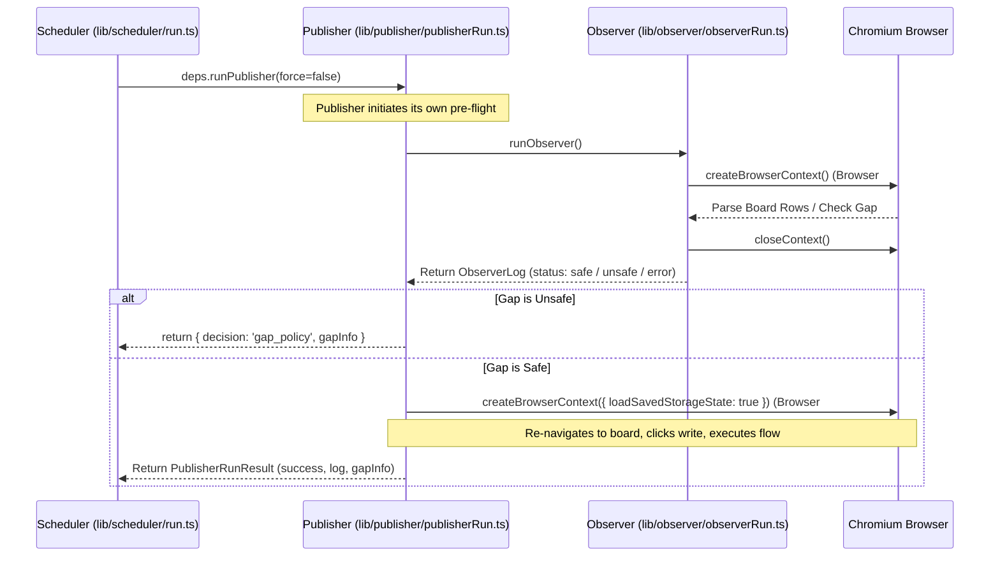
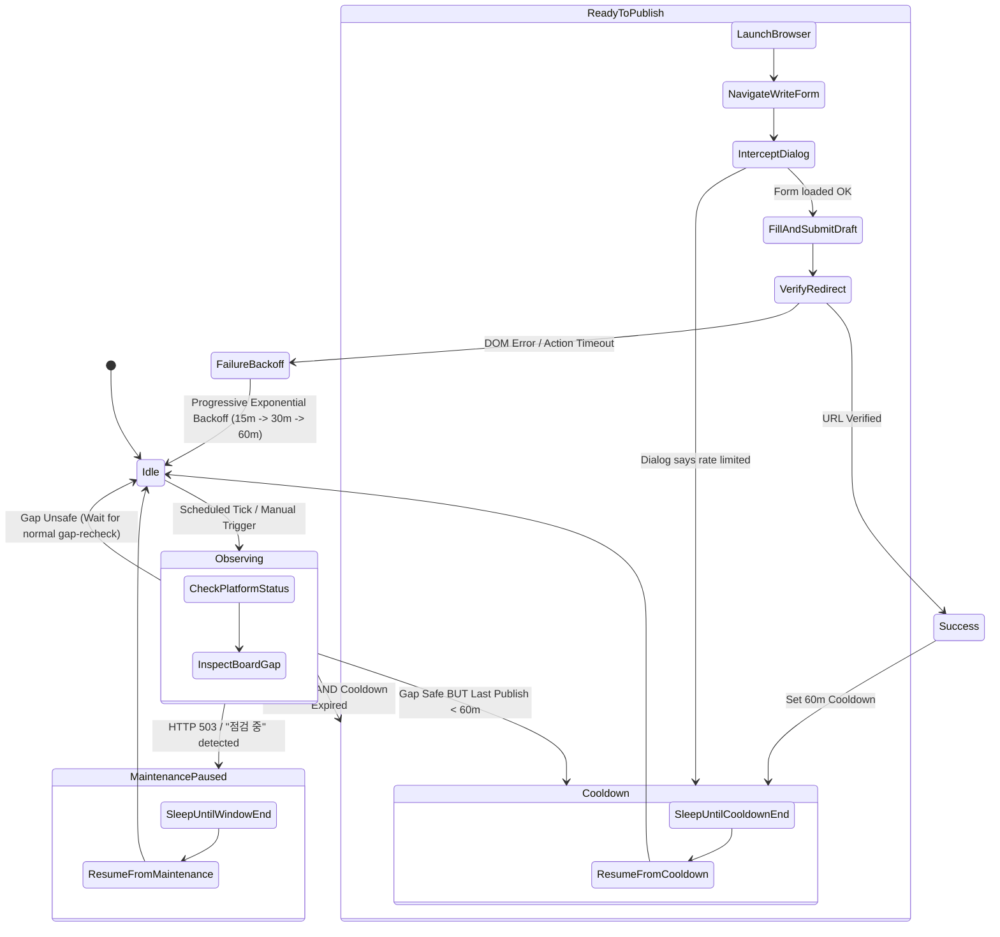

# Publisher Architecture, Configurability & Codebase Bloat Assessment

## 1. Executive Assessment: The System Architecture Trap

The recent auto-publisher failures on Ppomppu—unhandled server maintenance ("점검 중 입니다") and persistent 5-minute retry loops under the 1-post-per-hour rule—are symptoms of **architectural debt**, not isolated edge cases.

In a well-factored automation system, pausing for a maintenance window or respecting an hourly cooldown requires a single conditional guard or state-transition rule. In this codebase, implementing such a change currently requires touching **7 to 9 disparate components**:
`boardDiagnostics.ts` → `observerRun.ts` → `rateLimit.ts` → `runPublisherFlow.ts` → `publisherRun.ts` → `run.ts` → `publisher.ts` → `persistence.ts` → `control.ts`.

### Core Architectural Deficiencies
1. **Inverted Lifecycle & Architectural Coupling:** The Publisher is not a pure execution worker; it invokes the Observer internally, instantiating separate, duplicate Chromium browser contexts per run. The Scheduler has no direct visibility into board state and relies on nested return envelopes.
2. **Scattered State Authority & Configuration Conflicts:** Pacing, intervals, thresholds, and operational blocks are defined in at least **5 overlapping locations** (environment variables, contract JSONs, runtime JSON persistence, in-memory closures, and hardcoded script constants). A hardcoded fallback constant (`PUBLISHER_FAIL_RECHECK_INTERVAL = 5`) silently overrules all user-configured intervals and backoff blocks.
3. **"Fallbacks on Top of Fallbacks" Anti-Pattern:** Because the boundary between normal operation, rate-limiting, and error states is blurred, low-level UI functions attempt heroic, brittle DOM recovery (multiple fallback selectors, JavaScript `.click()` fallbacks, artificial timeouts) instead of failing early with structured domain errors.
4. **Severe Codebase Bloat & Script Sprawl:** Over 26 scripts sit in `scripts/`, over half of which are unreferenced, one-off debugging artifacts or stale experiments. Micro-file fragmentation across `lib/` adds heavy cognitive overhead without providing genuine modularity.

---

## 2. In-Depth Publisher Architecture & Configurability Analysis

### 2.1 Inverted Lifecycle & Double-Browser Overhead

The current execution sequence exhibits severe layer inversion:



#### Consequences:
- **Redundant Chromium Lifecycle:** Every publishing attempt spins up Chromium *twice*: first in `runObserver` to check the post gap, and immediately again in `runPublisher` to navigate to the exact same board URL.
- **Scheduler is Blind:** The Scheduler does not schedule based on direct observation. It triggers `runPublisher()`, which internally decides whether it was allowed to publish. This prevents the Scheduler from making intelligent, holistic decisions about platform health, maintenance windows, or rate limits before invoking heavy browser automation.

---

### 2.2 Configurability: Conflicting, Overlapping, and Irreconcilable

The system lacks a single source of truth for runtime configuration. Settings are fragmented across five disconnected tiers:

| Tier | Locations | Configuration Items | Precedence / Resolution |
| :--- | :--- | :--- | :--- |
| **Tier 1: Static Environment** | `config/env.ts` | `RUN_INTERVAL_MINUTES`, `BOT_GAP_THRESHOLD_MIN`, `PUBLISHER_DRAFT_ITEM_INDEX`, Timeouts | Default baseline; overridden by disk persistence if present. |
| **Tier 2: Spec-Kit Contracts** | `.planning/spec-kit/contracts/*.json` | `gap_threshold_min: 4`, board URL | Loaded dynamically from disk on each observer run. |
| **Tier 3: Runtime State File** | `ARTIFACTS_DIR/runtime-controls.json` | `baseIntervalMinutes`, `publishBlockedUntil`, `observerGapThresholdMin`, `preset` | Persisted on disk; read/written with `stateVersion` concurrency checks. |
| **Tier 4: In-Memory Controllers** | `lib/state/*.ts` & `lib/scheduler/run.ts` | `controls`, `preset`, `trendFactor`, `nextTickEta` | Ephemeral closure variables; can drift from disk state. |
| **Tier 5: Hardcoded Script Constants** | `lib/scheduler/run.ts`, `timeouts.ts`, `rateLimit.ts` | `PUBLISHER_FAIL_RECHECK_INTERVAL = 5`, `DRAFT_MODAL_ACTION_TIMEOUT_MS = 1000` | **Hardcoded in code. Silently overrides Tiers 1–4.** |

#### Key Configuration Failures:
1. **The 5-Minute Override Trap:** In `lib/scheduler/run.ts`:
   ```typescript
   const PUBLISHER_FAIL_RECHECK_INTERVAL = 5;
   if (fromGapSkip && typeof fromGapSkip === 'object') {
     const gapDiff = fromGapSkip.requiredGap - fromGapSkip.currentGap;
     if (gapDiff <= 0) {
       baseMinutes = PUBLISHER_FAIL_RECHECK_INTERVAL;
       nextMinutes = PUBLISHER_FAIL_RECHECK_INTERVAL;
     }
   }
   ```
   Even if the operator configures a 60-minute interval, selects a "conservative" preset, or sets `publishBlockedUntil`, any publishing error that occurs while the gap is safe (`gapDiff <= 0`) forcefully overrides all configuration and reschedules in **5 minutes**.
2. **Timeout Anarchy:**
   - Page navigation: `30,000ms` (`BOT_NAV_TIMEOUT_MS`)
   - Playbook locator: `5,000ms` (`PLAYBOOK_LOCATOR_TIMEOUT_MS`)
   - Selector candidate wait: `1,500ms` (`selectorResolver.ts`)
   - Draft modal action: `1,000ms` (`draftModal.ts`)
   - Draft fallback visible: `500ms` (`draftModal.ts`)

   A network blip or slight animation delay easily exceeds the 500ms–1000ms micro-timeouts in `draftModal.ts`, causing false-positive crashes while the higher-level navigation timeout is still healthy.

---

### 2.3 Stateful Fragility & Overwrite Races

1. **State Version Conflicts:**
   `lib/state/persistence.ts` implements optimistic concurrency control using `stateVersion`:
   ```typescript
   if (expectedVersion !== undefined && current.stateVersion !== expectedVersion) {
     throw new StateVersionConflictError(expectedVersion, current.stateVersion);
   }
   ```
   - When the dashboard UI saves settings (`POST /api/control-panel`), it passes the `stateVersion` it read.
   - However, background operations like `runPublisherFlow` also write to the same file (`persistPublishBlockedUntil`).
   - If a background flow writes a rate-limit block while an operator is saving a slider in the dashboard, the operator receives an HTTP 409 conflict. The route then re-reads disk state and reapplies, frequently **clobbering runtime blocks** or discarding form edits.
2. **Closure State vs Disk State Drift:**
   `lib/scheduler/run.ts` stores its configuration in a local closure variable `let controls = normalizeAutoPublisherControls(...)`. When changes occur on disk or via other routes, the scheduler closure does not reactively subscribe to changes; it only updates if `setPreset` or `updateControls` is explicitly called via the HTTP route handler.

---

### 2.4 Observability & Alert Hygiene

- **Conflation of Operational States with Crashes:**
  In `lib/publisher/publisherRun.ts`:
  ```typescript
  } else if (decision !== 'gap_policy') {
    await sendSlackNotification(`❌ *Publisher Failed* [${decision}]\n> ${message}`);
  }
  ```
  Every non-gap exit is branded as `❌ Publisher Failed`. Being rate-limited (normal platform cooldown) or hitting server maintenance (external platform outage) is broadcast as an internal failure.
- **Trace & Disk Space Exhaustion:**
  On failure, Playwright tracing unconditionally writes `trace.zip` to `artifacts/publisher-runs/<timestamp>/`. During a 5-minute retry storm (12 attempts/hour), the system generates hundreds of megabytes of traces for the exact same repeated error.

---

## 3. Codebase Bloat & Code Quality Audit

### 3.1 The "Fallbacks on Top of Fallbacks" Anti-Pattern

A hallmark of fragile architecture is compensating for ambiguous upstream contracts by piling defensive fallbacks into low-level code.

#### Example: `lib/publisher/ui/draftModal.ts` (218 lines)
- Tries primary modal root locator with regex class matching (`.popup_layer, .layer_popup, .pop_layer, [class*="layer_popup"]`).
- Catches error; falls back to `getDraftModalFallbackRoot` (generic `div` containing "임시저장된 게시글" and button "닫기").
- Scans `table tr`, iterates rows, filters checkboxes/radios, sorts, extracts labels.
- Attempts `locator.click({ timeout: 1000 })`.
- If click fails, falls back to JavaScript `.evaluate(el => el.click())`.
- Then searches for submit button using four alternative selectors.

**Why does this complexity exist?**
Because the system never verified whether clicking "글쓰기" actually loaded the write page! When Ppomppu triggers an alert or blocks access, the page remains on the board list. Instead of checking `page.url()` or detecting the rate-limit dialog up front, `draftModal.ts` is forced to guess, search, timeout, and execute fallback chains against a page where the modal doesn't even exist.

---

### 3.2 Micro-File Proliferation

The codebase contains numerous micro-files under 35 lines that introduce module boundary overhead without meaningful abstraction:

| Micro-File | Lines | Contents / Responsibility | Assessment |
| :--- | :--- | :--- | :--- |
| `lib/publisher/flow/loadPublisherPlaybook.ts` | 33 | Reads a JSON file from disk and calls `JSON.parse`. | **Redundant.** Inline into playbook runner. |
| `lib/publisher/flow/stateTransitions.ts` | 24 | Formats a draft selection suffix string. | **Trivial.** Consolidate into runner. |
| `lib/publisher/core/timeouts.ts` | 23 | Declares 4 timeout constants. | **Fragmented.** Belongs in unified config. |
| `lib/publisher/constants.ts` | 36 | Re-exports string literals like `PUBLISHER_DECISION`. | **Overlapping.** Duplicates `contracts/models.ts`. |
| `lib/publisher/ui/submit.ts` | 74 | Clicks submit with fallback to JS click. | **Consolidate.** Belongs in standard playbook action handler. |
| `lib/scheduleJitter.ts` | 26 | Calculates uniform random jitter. | **Trivial.** Inline into scheduler utils. |
| `bot.ts` | 119 | Obsolete re-export adapter for callers. | **Debt.** Repoint callers to `lib/` and delete. |

---

### 3.3 Script Sprawl & Orphan Inventory (`scripts/`)

The `scripts/` directory currently contains 26 files (over 180 KB of code). An audit reveals severe dead code and abandonment:

```
scripts/
├── ❌ Dead References (In package.json but files DO NOT EXIST):
│   ├── convert-recorder-to-playbook.mjs  (package.json:9 - ENOENT)
│   └── create-workflow-template.mjs      (package.json:10 - ENOENT)
│
├── 🗑️ Orphaned One-Off Scripts (Zero references in repo/package.json):
│   ├── apply_editorial_theme.py         (2.3 KB - dead styling experiment)
│   ├── update_colors.py                 (3.8 KB - dead styling experiment)
│   ├── test-all-vendors.ts              (7.8 KB - ad-hoc test script)
│   ├── analyze-problems.ts              (8.1 KB - ad-hoc debug tool)
│   ├── generate-demo-report.ts          (6.8 KB - unused report generator)
│   ├── audit-price-matrix.ts            (3.4 KB - obsolete pricing audit)
│   ├── discover-catalog-gaps.ts         (3.6 KB - ad-hoc catalog script)
│   ├── reimport-live-data.ts            (2.4 KB - manual migration script)
│   ├── test-full-pipeline.ts            (10.4 KB - duplicate ad-hoc integration test)
│   └── extract-products-with-ollama.ts  (3.2 KB - standalone experiment)
│
├── 🔄 Redundant / Consolidation Candidates:
│   ├── re-extract-cheerio-records.ts    (7.8 KB - overlaps competitor-ads-intel)
│   ├── re-extract-price-matrix.ts       (9.2 KB - overlaps competitor-ads-intel)
│   └── demo-extraction.ts               (7.6 KB - redundant demo)
│
└── ✅ Active & Essential Scripts:
    ├── check-structure.ts               (Structure linter)
    ├── clean-workspace.sh               (Hygiene)
    ├── install-hooks.sh                 (Git hooks)
    ├── run-tests.sh                     (Test runner)
    ├── mempalace-loop.sh                (Agent memory loop)
    ├── competitor-ads-intel.ts          (Active competitor pipeline)
    ├── kakao-ingest.ts / annotate / export (Active KakaoTalk pipeline)
    ├── scheduler_signal_replay.ts       (Scheduler calibration)
    └── publisher_history_jsonl_to_parquet.py (Log transformation)
```

**Pruning Opportunity:** Deleting the 10 orphaned scripts and cleaning up dead `package.json` entries immediately removes **~55 KB of dead code**, simplifies repository navigation, and reduces maintenance burden.

---

## 4. Target Architecture: The Clean State-Machine Publisher

To eliminate state drift, 5-minute loops, and double-browser launches, the publishing system should be refactored around a **Finite State Machine (FSM)** with a **Unified Runtime Store**.

### 4.1 Publisher State Machine Model



### 4.2 Architectural Improvements

#### 1. Single Browser Lifecycle (Zero Redundant Launches)
- The Observer runs as a lightweight pre-flight step. If headless HTTP scraping (or a single persistent page) indicates maintenance or insufficient gap, **Chromium is not launched for publishing**.
- When publishing proceeds, the active browser page from observation can be transitioned directly to the write flow without tearing down and recreating browser contexts.

#### 2. Proactive History-Driven Cooldown (Zero-Overhead Gating)
- Before touching the browser, the publisher checks `publisherHistory.getLastVerifiedPublishTime()`.
- If `Date.now() - lastPublishTime < 60 minutes`:
  - **No browser is launched.**
  - System enters `Cooldown` state.
  - Scheduler sets its timer to `lastPublishTime + 60m + jitter`.
  - Zero CPU wasted; zero bot detection risk.

#### 3. Maintenance Window Rescheduling
- When `Observing` encounters HTTP 503 or `"점검 중입니다"`:
  - Regex parses the maintenance window (`HH:mm ~ HH:mm`).
  - Sets `maintenanceBlockedUntil` in the state store.
  - Slack receives a single `🚧 Maintenance Notice` (not an error alert).
  - Scheduler pauses all executions until the maintenance window concludes.

#### 4. Unified State Store (Eliminating Optimistic Concurrency Overwrite)
- Consolidate `lib/state/observer.ts`, `lib/state/publisher.ts`, and `lib/state/scheduler.ts` into a single **Observable Runtime Store**:
  - In-memory state is the single authoritative source during process life.
  - State changes trigger an asynchronous debounced write to `runtime-controls.json`.
  - Subsystems (Scheduler, Publisher, API routes) subscribe to state events (`store.on('change', ...)`) rather than independently reading disk files or managing divergent closures.

---

## 5. Refactoring & Consolidation Blueprint

### 5.1 Proposed Module Layout (Post-Refactoring)

```
lib/
├── config/              # Single source of truth for runtime configs & limits
│   ├── env.ts           # Canonical env parsing
│   └── defaults.ts      # Unified intervals, timeouts, and thresholds
├── state/               # Single authoritative runtime state engine
│   ├── store.ts         # In-memory reactive state store (EventEmitter)
│   ├── persistence.ts   # Debounced disk sync (runtime-controls.json)
│   └── index.ts         # Clean external API
├── publisher/           # Unified publishing subsystem
│   ├── engine.ts        # Publisher FSM (Lifecycle, cooldown, maintenance)
│   ├── flow.ts          # Playbook execution (Dialog interception, submit)
│   ├── history.ts       # History queries & append-only log (moved from lib/publisherHistory.ts)
│   ├── rateLimit.ts     # Regex & dialog parsing
│   └── index.ts
├── observer/            # Board monitoring & diagnostics
│   ├── diagnostics.ts   # Maintenance parser & access health
│   ├── parser.ts        # Row extraction
│   └── index.ts
└── scheduler/           # Pure timer & pacing coordinator
    ├── scheduler.ts     # Pacing engine (Recheck, backoff, jitter, FSM listener)
    └── index.ts
```

### 5.2 Micro-File Consolidation Plan

1. **Inline into `lib/publisher/flow.ts`:**
   - `lib/publisher/flow/loadPublisherPlaybook.ts` (33 lines)
   - `lib/publisher/flow/stateTransitions.ts` (24 lines)
   - `lib/publisher/ui/submit.ts` (74 lines)
2. **Move into `lib/publisher/`:**
   - `lib/publisherHistory.ts` → `lib/publisher/history.ts`
   - `lib/publisherStepStore.ts` → `lib/publisher/stepStore.ts`
3. **Eliminate `bot.ts`:**
   - Repoint callers in `server.ts` and routes to import from `lib/publisher`, `lib/observer`, and `lib/state`.
   - Delete `bot.ts` (119 lines of debt).

---

## 6. Phased Implementation Plan & Effort Estimation

| Phase | Focus Area | Tasks & Deliverables | Estimated Effort | Impact / ROI |
| :--- | :--- | :--- | :--- | :--- |
| **Phase 1: Immediate Bloat Pruning** | Script Hygiene | • Delete 10 orphaned scripts in `scripts/`<br>• Clean dead entries in `package.json`<br>• Update `.structure.json` | **2–3 Hours (1 SP)** | **High**: Eliminates 55KB dead code; cleans developer workflow. |
| **Phase 2: Stabilize Publisher & Scheduler** | Cooldown & Loop Fix | • Add pre-flight 60m cooldown check in `publisherRun`<br>• Remove hardcoded 5-minute loop in `run.ts`<br>• Add `dialog` event listener for write alerts | **4–5 Hours (3 SP)** | **Critical**: Stops repeated 5-min failure storms and account risk. |
| **Phase 3: Maintenance Engine & Alerting** | Maintenance Handling | • Add Korean maintenance notice regex parser in `boardDiagnostics.ts`<br>• Integrate `maintenanceBlockedUntil` with scheduler pause<br>• Rationalize Slack alerts (clean `🚧` notices) | **4–5 Hours (3 SP)** | **High**: Eliminates false-positive 503 error spam; automates recovery. |
| **Phase 4: Architecture Consolidation** | Modularity & Clean State | • Consolidate micro-files into `lib/publisher/flow.ts`<br>• Unify state store in `lib/state/`<br>• Repoint callers and eliminate `bot.ts` adapter | **6–8 Hours (4 SP)** | **High**: Solves state drift; creates clean, extensible architecture. |
| **Total** | **Full Modernization** | **All 4 Phases** | **16–21 Hours (~2.5 Days)** | **Permanent stability & simplicity** |

---

## 7. Conclusion & Next Steps

The auto-publisher's recurring failures are direct consequences of architectural coupling, fragmented state, and uncoordinated fallback loops.

By executing the pruning and refactoring roadmap:
1. **Repository bloat is eliminated** by removing dead scripts and redundant micro-files.
2. **Operational reliability is restored** through proactive cooldown gating and automated maintenance pausing.
3. **The codebase becomes vastly easier to maintain**, reducing the friction of future feature additions from days to hours.
