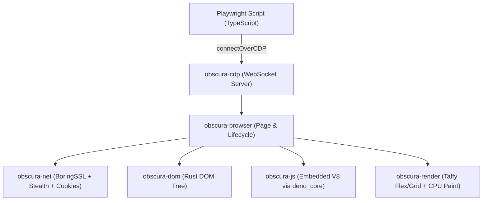
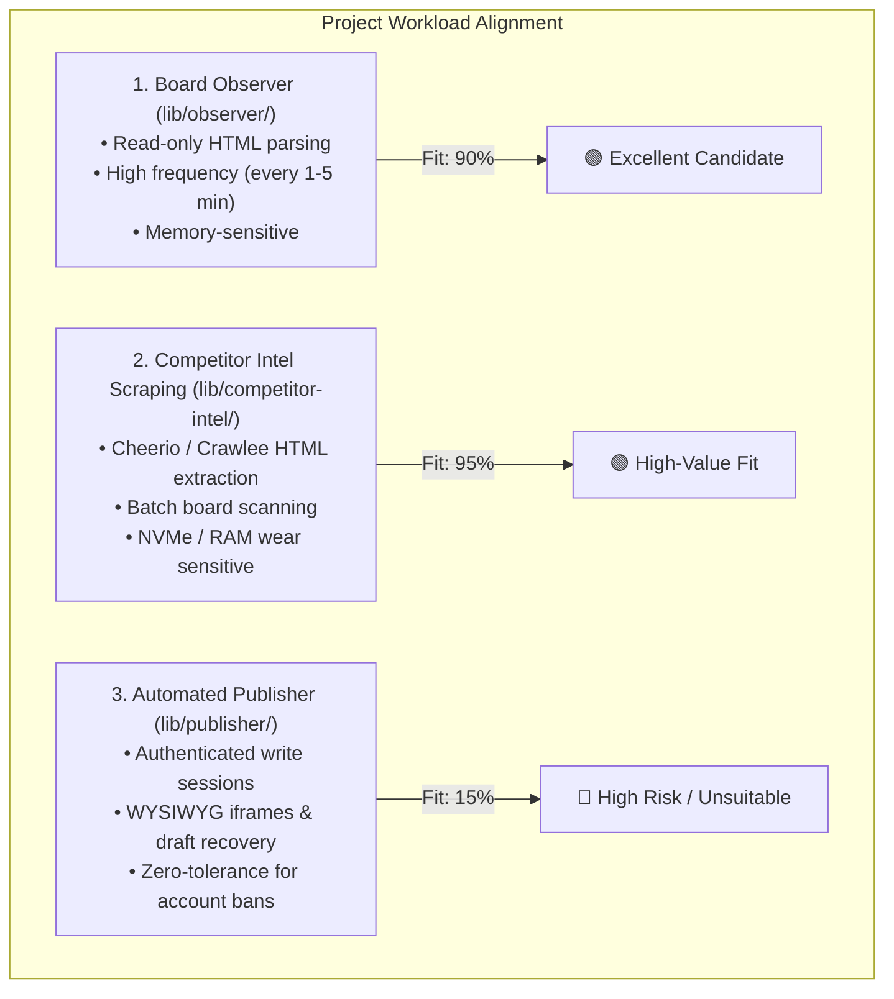

# Browser Alternative Assessment: Obscura (Rust Headless Browser)

## 1. Executive Summary & Verdict

This assessment evaluates **Obscura** (`h4ckf0r0day/obscura`), an open-source headless browser written in Rust, as a potential lightweight alternative to Chromium for the `forum-marketing-automation` repository.

```
┌───────────────────────────────────────────────────────────────────────────────────┐
│                                VERDICT AT A GLANCE                                │
├────────────────────────────────┬──────────────────────────────────────────────────┤
│ Compatibility with Playwright  │ 🟡 Partial (Connects via connectOverCDP only)     │
│ Resource Efficiency            │ 🟢 Outstanding (~30 MB RAM vs 250+ MB Chromium)  │
│ Observer & Scraping Alignment  │ 🟢 High (Ideal for read-only gap checks & intel)  │
│ Publisher Workflow Alignment   │ 🔴 Unsuitable / High Risk (Breaks write & auth)   │
│ Final Recommendation           │ ⚠️ Do NOT replace Chromium for Publisher;          │
│                                │    Evaluate as a lightweight Observer/Scraper daemon│
└────────────────────────────────┴──────────────────────────────────────────────────┘
```

---

## 2. What Exactly is Obscura?

Obscura is **not** a wrapper around Chromium, Firefox, or WebKit. It is an independent, ground-up headless browser engine written in **Rust**:



### Core Architecture & Capabilities
1. **Embedded V8 Engine:** Runs real JavaScript by embedding V8 through `deno_core`. It exposes standard browser globals (`window`, `document`, `location`, `fetch`) via Rust-backed operations (`ops.rs`).
2. **Custom DOM & Rendering Engine:** Parses HTML into its own Rust DOM tree (`obscura-dom`) and uses Taffy for layout calculations, with a CPU-backed rasterizer for screenshots and PDFs.
3. **Chrome DevTools Protocol (CDP) Server:** Speaks CDP over WebSockets on port `9222`, allowing standard automation tools (Playwright, Puppeteer) to control it remotely.
4. **Built-in Stealth & Anti-Detection:** Uses `wreq` with BoringSSL for TLS fingerprint spoofing (mimicking standard Chrome TLS client hellos), canvas/GPU fingerprint randomization, and built-in tracking domain blocklists.
5. **Footprint:** Distributed as a standalone ~70 MB static binary requiring no system Chrome, running with ~30 MB memory and ~85 ms page loads.

---

## 3. Compatibility Analysis: Obscura vs. Our Playwright Stack

While Obscura advertises Playwright compatibility, there are **critical architectural differences** between running native Chromium and connecting to Obscura over CDP:

| Capability / Requirement | Current Chromium Stack | Obscura Engine | Compatibility Impact on This Project |
| :--- | :--- | :--- | :--- |
| **Connection Method** | `chromium.launch()` or `launchPersistentContext()` | `chromium.connectOverCDP('ws://127.0.0.1:9222')` | ⚠️ Requires running Obscura as an external background daemon (`obscura serve`). Cannot be spawned in-process. |
| **Persistent Contexts (`userDataDir`)** | 🟢 Native support (`launchPersistentContext`) | 🔴 **Unsupported** over CDP. | 🚨 **Blocker for Publisher.** We rely on persistent Chromium user directories to preserve Ppomppu login cookies, local storage, and session state. With Obscura, cookies must be manually injected via `context.addCookies()` on every run. |
| **Headed Mode (`BROWSER_HEADLESS=false`)** | 🟢 Native GUI rendering | 🔴 **No GUI window support** (pure headless only). | ⚠️ Hinders operator debugging when diagnosing Korean WAF blocks, CAPTCHA challenges, or visual layout drifts. |
| **Playwright Locator API** | 🟢 Full CSS, XPath, text, role, pseudo-classes | 🟡 Partial | Standard locators work, but complex Playwright pseudo-selectors (`:has()`, `:has-text()`, chained filters) depend on Obscura's CDP DOM mapping. |
| **Alert Dialog Handling (`page.on('dialog')`)** | 🟢 Native Chrome dialog events | 🟡 Limited / Unpredictable | Obscura handles basic alerts, but Ppomppu's legacy inline `<script>alert(...); history.back();</script>` behavior is not guaranteed to trigger CDP `Page.javascriptDialogOpening` cleanly. |
| **JavaScript / Web API Fidelity** | 🟢 100% Chrome/Blink standard | 🔴 **Subset only.** Shims manually added in `bootstrap.js`. | 🚨 **Severe Risk for Publisher.** Ppomppu's write form uses legacy 2000s-era JavaScript (WYSIWYG editors, iframes, multi-part form submissions, image input types). Any missing Web API in `deno_core` will cause silent script crashes. |
| **Concurrency & Threading** | 🟢 Multi-process; isolated V8 isolates per tab | 🟡 **Single shared V8 isolate** with a global mutex lock (`v8_lock`). | Running multiple concurrent pages serializes JavaScript execution across pages. |

---

## 4. Workload Alignment: Can It Be Repurposed in This Project?

Our repository has three distinct browser automation workloads with vastly different requirements:



### Workload 1: The Board Observer (`lib/observer/`) — 🟢 High Alignment
- **Current Problem:** `runObserver()` launches a full Chromium instance every few minutes just to check if competitor posts exceed the safety gap. This accounts for significant NVMe wear and memory spikes (tracked in `KE-002`).
- **Obscura Alignment:** Obscura is designed for this exact use case. It loads pages in ~85ms, uses 30MB RAM, and extracts DOM rows without needing a full browser subsystem.
- **Feasibility:** Obscura could serve as an ultra-fast, zero-overhead board probe.

### Workload 2: Competitor Ad Intel Scraping (`lib/competitor-intel/`) — 🟢 High Alignment
- **Current Problem:** Running Crawlee crawlers with headless Chromium consumes 500MB–1GB RAM and triggers occasional Docker OOM events.
- **Obscura Alignment:** Obscura's built-in stealth networking (BoringSSL TLS fingerprint spoofing) and tracker blocking would bypass bot-detection while using a fraction of the RAM.

### Workload 3: The Auto-Publisher (`lib/publisher/`) — 🔴 Severe Hazard / Unsuitable
- **Current Requirement:** The publisher logs into Ppomppu, navigates to `write.php`, restores drafts from a dynamically populated modal (`open-saved-drafts`), interacts with draft table rows, verifies category selectors, and submits form payloads with verified URL redirects.
- **Obscura Misalignment:**
  - Obscura is an **experimental browser engine**. It does not implement all quirks of legacy browser DOMs (e.g. Internet Explorer / old Netscape compatibility layers that Ppomppu's PHP frontend relies on).
  - A failure in Obscura's V8 shim during draft restoration or form submission risks corrupted posts, half-submitted drafts, or spam detection penalties from the forum moderators.
  - **Verdict:** Do **not** use Obscura for the Publisher.

---

## 5. Potential Hybrid Architecture (If Adopted)

If the team wishes to leverage Obscura's lightweight footprint, the only sound architecture is a **Dual-Engine Hybrid**:

```mermaid
flowchart LR
    Scheduler["Scheduler (lib/scheduler/run.ts)"]

    subgraph LightEngine["Lightweight Engine (Obscura CDP Daemon)"]
        Obs["Observer Run (lib/observer/)"]
        Intel["Competitor Intel (lib/competitor-intel/)"]
    end

    subgraph HeavyEngine["Full Engine (Headless Chromium)"]
        Pub["Publisher Run (lib/publisher/)"]
    end

    Scheduler -->|1. Fast Gap Check (85ms, 30MB)| Obs
    Scheduler -->|2. Only if Gap Safe & Cooldown OK| Pub
    Intel -.->|Periodic Scraping| Obs
```

### How It Would Work:
1. **Daemon Setup:** Obscura runs as a background service via Docker or systemd:
   ```bash
   obscura serve --port 9222 --stealth
   ```
2. **Observer Repointing:** `lib/observer/observerRun.ts` connects via CDP:
   ```typescript
   // Fast 30MB probe instead of launching heavy Chromium
   const browser = await chromium.connectOverCDP(ENV.OBSCURA_CDP_URL || 'ws://127.0.0.1:9222');
   ```
3. **Publisher Unchanged:** `lib/publisher/publisherRun.ts` retains native Playwright Chromium with `launchPersistentContext()` for 100% DOM fidelity, cookie safety, and session resilience.

---

## 6. Trade-off & Risk Assessment

| Consideration | Native Chromium (Status Quo) | Obscura (Rust Engine) |
| :--- | :--- | :--- |
| **RAM Consumption** | ~250–400 MB per browser instance | ~30–50 MB per instance (85% reduction) |
| **Cold Startup Latency** | 1.5–3.0 seconds | Instant (<100 ms) |
| **Docker Image Size** | Requires Chromium binaries (~300 MB) | Single static binary (~70 MB) |
| **Web Standards & Legacy Compatibility** | 100% Blink standard | Custom Rust DOM; edge-case compatibility risks |
| **Anti-Bot Evasion** | Requires custom stealth scripts & UA spoofing | Native BoringSSL TLS hello & canvas spoofing |
| **Project Maturity** | Industry standard (Millions of users, backed by Microsoft) | Early-stage community project (Solo/small team maintainer) |
| **Operational Complexity** | In-process execution via Playwright npm package | Requires managing an external daemon process |

---

## 7. Conclusions & Recommended Action Plan

### Direct Answers to Your Questions:
1. **What is it exactly?** An independent headless browser written from scratch in Rust with an embedded V8 JS runtime and a Chrome DevTools Protocol (CDP) server. It is not Chromium.
2. **Is it compatible?** Partially. It can be controlled via Playwright's `connectOverCDP()`, but does **not** support `launchPersistentContext`, headed mode, or the complete Blink Web API specification.
3. **Do the use cases align?**
   - **Yes** for passive, high-frequency read tasks (Board Observer gap checks, competitor ad scraping).
   - **No** for transactional write tasks (Auto-Publisher draft restoration and posting).
4. **Can it be used at all?** Yes, as an external CDP daemon for read-only observing, but **not as a drop-in replacement for the entire project**.

### Recommendation:
- **Immediate Term:** Prioritize the architectural refactoring of the Publisher (proactive 60-minute cooldown check, maintenance window parsing, and removing the hardcoded 5-minute retry loop) using our existing, reliable Chromium stack.
- **Future Spike (Optional):** If server RAM on your VPS is severely constrained, conduct a 1-day proof-of-concept spike running Obscura strictly for `runObserver()` to evaluate whether it parses Ppomppu's `tr.list0, tr.list1` board rows identically to Chromium.
