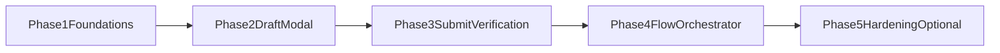

# Publisher Refactor Roadmap

Primary epic: [`/parent/marketing-automation/.planning/spec-kit/archive/plans/epics/publisher-refactor-epic.md`](/parent/marketing-automation/.planning/spec-kit/archive/plans/epics/publisher-refactor-epic.md)
Constraints checklist: [`/parent/marketing-automation/.planning/spec-kit/archive/plans/tasks/publisher-refactor-constraints-checklist.md`](/parent/marketing-automation/.planning/spec-kit/archive/plans/tasks/publisher-refactor-constraints-checklist.md)

## Objective
Execute the publisher internal refactor in behavior-preserving phases while keeping fail-closed guarantees and verification semantics unchanged.

## Phase Sequence
1. **Foundations (Phase 1)** - extract shared timeouts and selector-resolution utilities with no behavior changes.
2. **Draft Modal (Phase 2)** - isolate modal lifecycle handling behind a dedicated module.
3. **Submit + Verification (Phase 3)** - isolate submit flow and post-submit redirect checks.
4. **Flow + Orchestrator (Phase 4)** - introduce composed flow runner and keep `bot.ts` thin.
5. **Hardening (Phase 5, optional)** - add focused coverage/diagnostics after baseline parity is complete.

## Dependency Flow

## Phase Gates
- **Gate A (after Phase 1):** extracted modules compile cleanly; no contract/env/schema changes.
- **Gate B (after Phase 2):** modal open/load/close behavior remains deterministic and fail-closed.
- **Gate C (after Phase 3):** success still requires transition to list/view URL with bounded waits.
- **Gate D (after Phase 4):** publisher API contract and artifact behavior remain unchanged.
- **Gate E (after Phase 5):** additional test coverage exists without changing runtime semantics.

## Exit Criteria Per Phase
- `npm run lint` passes.
- `npm run test:integration` passes.
- For Phases 2-4, at least one real publisher run confirms no regression in draft load, freeze-clear, submit, and URL verification.

## Rollout Rules
- Move code first, simplify later.
- Keep each phase deployable and reviewable on its own.
- Stop phase rollout immediately if fail-closed behavior weakens, then patch before proceeding.
