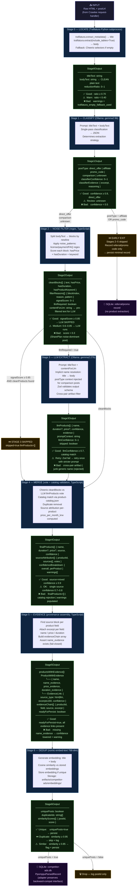

```mermaid
flowchart TD
    INPUT["📥 INPUT\nRaw HTML + postUrl\n(from Crawlee request-handler)"]

    subgraph S0["Stage 0 — LOCATE  (Trafilatura Python subprocess)"]
        direction LR
        S0a["trafilatura.extract_metadata() → title\ntrafilatura.extract(include_tables=True) → body\nFallback: Cheerio selectors if empty"]
    end

    INPUT --> S0
    S0 --> Q0["Stage0Output\n────────────────────\ntitleText: string\nbodyText: string  ← CLEAN plain text\nreductionRatio: 0–1\n────────────────────\n✅ Good:  ratio ≥ 0.70\n⚠️  Warn:  ratio < 0.40\n❌ Bad:   warnings = trafilatura_empty_fallback_used"]

    subgraph S1["Stage 1 — CLASSIFY  (Ollama: gemma2:9b)"]
        direction LR
        S1a["Prompt: titleText + bodyText\nSingle-pass classification → JSON\nDetermines extraction strategy"]
    end

    Q0 --> S1
    S1 --> Q1["Stage1Output\n────────────────────\npostType: direct_offer | affiliate\n          promo_code | comparison | unknown\nclassifierConfidence: 0–1\nclassifierEvidence: { excerpt, reasoning }\n────────────────────\n✅ Good:  confidence ≥ 0.9, direct_offer\n⚠️  Review: unknown\n❌ Bad:   confidence < 0.5"]

    Q1 -->|"postType = affiliate\nOR promo_code"| EARLY["⏭️ EARLY EXIT\nStages 2–5 skipped\nRecord referral/promo code only\n→ persist minimal record"]

    subgraph S2["Stage 2 — NOISE FILTER  (regex, TypeScript)"]
        direction LR
        S2a["Split bodyText → blocks by newline\nApply noise_patterns: license/payment/FAQ regex\nScore each block: hasPrice + hasDuration + keyword"]
    end

    Q1 -->|"direct_offer\ncomparison\nunknown"| S2

    S2 --> Q2["Stage2Output\n────────────────────\ncleanBlocks[]: { text, hasPrice, hasDuration, hasProductKeyword }\nfilterReasons[]: { blockIndex, reason, pattern }\nsignalScore: 0–1\nllmRequired: boolean\ncontentForLlm: string  ← pre-filtered text for LLM\n────────────────────\n✅ Good:  signalScore ≥ 0.85 → LLM SKIPPED\n⚠️  Medium: 0.6–0.85 → LLM runs\n❌ Bad:   score < 0.3  (SharePlan noise-dominant post)"]

    Q2 -->|"signalScore ≥ 0.85\nAND cleanProducts found"| LLMSKIP["⏭️ STAGE 3 SKIPPED\nskipped=true  llmProducts=[]"]

    subgraph S3["Stage 3 — LLM EXTRACT  (Ollama: gemma2:27b)"]
        direction LR
        S3a["Prompt: titleText + contentForLlm\nImplicit name resolution: title → body\npostType context injected for comparison posts\nZod validates output schema\nCross-pair artifact filter"]
    end

    Q2 -->|"llmRequired = true"| S3
    S3 --> Q3["Stage3Output\n────────────────────\nllmProducts[]: { name, duration?, price?, confidence, evidence }\npromptContext: string\nllmConfidence: 0–1\nskipped: boolean\n────────────────────\n✅ Good:  llmConfidence ≥ 0.7, catalog match\n⚠️  Retry: Zod fail → retry once with stricter prompt\n❌ Bad:   cross-pair artifact | junk generic name (rejected)"]

    subgraph S4["Stage 4 — MERGE  (vote + catalog validation, TypeScript)"]
        direction LR
        S4a["Cheerio cleanBlocks vs LLM llmProducts vote\nCatalog match via product-catalog.json\nDuplicate removal\nSource attribution per-product\nprice_per_month_krw computed"]
    end

    LLMSKIP --> S4
    Q3 --> S4
    Q2 -->|"cleanBlocks"| S4

    S4 --> Q4["Stage4Output\n────────────────────\nfinalProducts[]: { name, duration?, price?, source, confidence }\nsourceAttribution[]: { productId, sources[], votes }\nconfidenceBreakdown: { overall, perProduct }\nwarnings[]\n────────────────────\n✅ Good:  source=mixed  confidence ≥ 0.9\n⚠️  OK:   single source  confidence 0.7–0.8\n❌ Bad:   finalProducts=[] | catalog rejection | warnings populated"]

    subgraph S5["Stage 5 — EVIDENCE  (provenance assembly, TypeScript)"]
        direction LR
        S5a["Find source block per product field\nAttach excerpt per field: name / price / duration\nBuild evidenceChain array\nAssert name_evidence exists (fail-closed)"]
    end

    Q4 --> S5
    S5 --> Q5["Stage5Output\n────────────────────\nproductsWithEvidence[]: ProductWithEvidence\n  └── { name, name_evidence, price_evidence, duration_evidence }\n  └── EvidenceLink: { source_type: html|llm, excerpt≤160, confidence }\nevidenceChain[]: { productId, field, source, excerpt }\nreadyForPersist: boolean\n────────────────────\n✅ Good:  readyForPersist=true, all evidence links present\n❌ Bad:   missing name_evidence → confidence lowered + warning"]

    subgraph S6["Stage 6 — DEDUP  (nomic-embed-text 768-dim)"]
        direction LR
        S6a["Generate embedding: title + body\nCosine similarity vs stored embeddings\nStore embedding if unique\nStorage: artifacts/competitor-ads/embeddings/"]
    end

    Q5 --> S6
    S6 --> Q6["Stage6Output\n────────────────────\nuniquePosts: boolean\nduplicateIds: string[]\nsimilarityScores[]: { postId, score }\n────────────────────\n✅ Unique:    uniquePosts=true → persist\n⏭️ Duplicate:  similarity ≥ 0.95 → skip + log\n⚠️  Similar:   similarity ≥ 0.85 → flag + persist"]

    Q6 -->|"uniquePosts = true"| DB["💾 SQLite: competitor-ads.db\nPpomppuParsedRecord\n(adapter preserves backward-compat interface)"]
    Q6 -->|"uniquePosts = false"| DROP["🗑️ Drop — log postId only"]
    EARLY --> DB2["💾 SQLite: referral/promo record\n(no product extraction)"]

    classDef stageBox fill:#0f2540,stroke:#3a82c4,color:#d0e8ff
    classDef outputBox fill:#0d1f0d,stroke:#3ab84a,color:#c8ffc8
    classDef skipBox fill:#2b1f00,stroke:#cc9900,color:#fff3cc
    classDef finalBox fill:#1a0a2e,stroke:#9966cc,color:#f0d0ff
    classDef inputBox fill:#1a1a2e,stroke:#6666ff,color:#ccccff

    class S0,S1,S2,S3,S4,S5,S6 stageBox
    class Q0,Q1,Q2,Q3,Q4,Q5,Q6 outputBox
    class EARLY,LLMSKIP,DROP skipBox
    class DB,DB2 finalBox
    class INPUT inputBox
```
