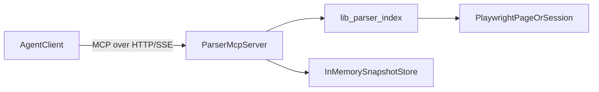

# Ppomppu OTT Automation Bot

Node + Playwright automation bot for observing and posting to the Ppomppu OTT board, with a React dashboard for monitoring.

## Stack
- Backend: Express + TypeScript
- Automation: Playwright
- Frontend: React + Vite
- Contracts/Planning: `.planning/spec-kit`, `.agent`

## Quick Start
1. Install dependencies:
   - `npm install`
2. Set environment variables:
   - copy `.env.example` to `.env`
3. Run locally:
   - `npm run dev`

## Project Structure
- `server.ts` - API + Vite middleware
- `bot.ts` - observer/publisher workflow
- `lib/parser/` - low-noise DOM projection, outline/subtree APIs, and snapshot diff
- `src/` - dashboard UI
- `config/env.ts` - strict env validation
- `.planning/spec-kit/` - AI-facing planning specs/contracts
- `.agent/` - state, contracts, and handovers

---

# Implement Parser MCP Server (TypeScript + SSE/HTTP) (DRAFT)

## Framework decision
- Use **TypeScript + `@modelcontextprotocol/sdk`**.
- Rationale for this repo:
  - Existing runtime is Node/TypeScript (`tsx`, Express, Playwright).
  - Parser logic already exists in [`/parent/marketing-automation/lib/parser/index.ts`](/parent/marketing-automation/lib/parser/index.ts).
  - Avoids Python sidecar complexity and cross-runtime packaging.

## Target architecture
- Add a dedicated MCP server process in repo (do not embed in existing API server route handlers).
- Use SDK transport for **HTTP/SSE-compatible MCP access**.
- Keep parser as domain logic and expose thin MCP tools:
  - `page_outline`
  - `subtree`
  - `interactive_elements`
  - `snapshot_diff`

---

## Low-Noise Parser For Agents
- Primary parser entrypoints live in `lib/parser/index.ts`:
  - `pageOutline(page, options)` for map-first navigation (landmarks/headings/forms/interactives)
  - `subtree(page, selector, options)` for bounded drill-down
  - `interactiveElements(page, options)` for action-focused extraction
  - `snapshotDiff(prev, next)` for change-only context between steps
- Parser output is capped (`maxDepth`, `maxSiblingsPerNode`, `maxTotalNodes`, `maxTextLengthPerNode`) to prevent context blowups.
- Observer fail-closed behavior now uses both legacy row parser confidence and projected parser confidence; lower confidence wins.
- Raw HTML should be treated as fallback for edge cases only (custom widgets, rendering quirks, or parser truncation warnings).

## Notes
- Fails closed when required env/config is invalid.
- Designed for single-forum now, multi-forum extension later via workflow and adapter contracts.
