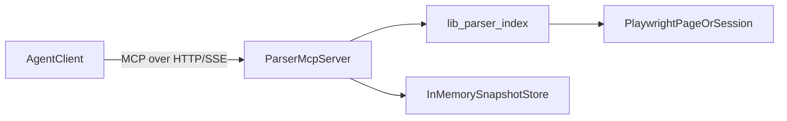

# Ppomppu OTT Automation Bot

Node + Playwright automation bot for observing and posting to the Ppomppu OTT board, with a React dashboard for monitoring.

## Stack
- Backend: Express + TypeScript
- Automation: Playwright
- Frontend: React + Vite
- Contracts/Planning: `.planning/spec-kit`, `.agent`

## Agent Grounding
- Agent runbook: `AGENTS.md`
- Always-applied rules:
  - `.cursor/rules/parser-mcp-usage.mdc`
  - `.cursor/rules/env-usage-guardrails.mdc`
  - `.cursor/rules/publisher-regression-guardrails.mdc`

## Quick Start
1. Install dependencies:
   - `npm install`
2. Set environment variables:
   - copy `.env.example` to `.env`
3. Run locally:
   - `npm run dev`

## Tests
- Full suite (TypeScript check + API integration + parser MCP):
  - `npm run test`
- Individual:
  - `npm run lint` — `tsc --noEmit`
  - `npm run test:integration` — Express API contracts (uses env vars on the command line; loads `.env` if present)
  - `npm run test:mcp:parser` — Parser MCP server tools (`page_outline`, `subtree`, `interactive_elements`, `snapshot_diff`) against synthetic HTML

## AWS Remote Ops (Spec-Driven)

- Spec contracts:
  - `.planning/spec-kit/specs/remote-ops.access.contract.json`
  - `.planning/spec-kit/specs/remote-ops.runtime.contract.json`
  - `.planning/spec-kit/specs/remote-ops.deploy.contract.json`
  - `.planning/spec-kit/specs/remote-ops.observability.contract.json`
  - `.planning/spec-kit/specs/remote-ops.acceptance.plan.json`
- Taskset:
  - `.planning/spec-kit/tasks/implementation.tasks.json` (`remote_ops_taskset`)
- Operational templates and runbooks:
  - `ops/aws/ec2-baseline.md`
  - `ops/aws/remote-access-runbook.md`
  - `ops/systemd/marketing-automation.service`
  - `ops/systemd/load-env-from-ssm.sh`
  - `ops/systemd/cleanup-artifacts.sh`
  - `ops/deploy/deploy-release.sh`
  - `ops/deploy/rollback-release.sh`
  - `.github/workflows/deploy-aws.yml`
  - `ops/observability/cloudwatch-agent-config.json`
  - `ops/observability/alarms-runbook.md`

Execution loop per session: `spec_update -> task_selection -> implement_slice -> verify_gates -> handover_write`.

### Auditing `ReferenceError: __name is not defined` in the observer
TypeScript can emit `__name(...)` inside functions serialized for `page.evaluate`. The browser does not provide that helper.

1. **Required:** every `BrowserContext` used by the bot or parser MCP registers `lib/playwright/browser-eval-polyfill.ts` via `addInitScript` **before** navigation (see `addStealthInitScripts` in `bot.ts` and `ParserSessionManager` in `mcp/parser-session.ts`).
2. **Code style:** in `lib/parser/dom-projector.ts`, keep in-page logic as `const` arrows, not nested `function` declarations (reduces stray `__name` emit).
3. **After code changes:** restart `npm run dev` and run `npm run test` (parser MCP test exercises real Chromium + `page.evaluate`).

## Dry-run workflow (demo)
Use this to exercise the bot **without** submitting a real post.

1. **Environment** (minimum):
   - `DRY_RUN_MODE=true` (default in `.env.example`)
   - `BROWSER_HEADLESS=true` on headless Linux/WSL/Docker (default). If you set `BROWSER_HEADLESS=false`, you need a display; on Linux without `DISPLAY`, the runtime **coerces headless** and logs a warning.
   - Valid `PROJECT_ROOT`, `PPOMPPU_*`, `BOT_PROFILE_DIR`, `ACTIVITY_LOG_PATH`, `FORUM_PRIMARY_ID=ppomppu`
2. **Start the app**: `npm run dev` → dashboard at `http://localhost:<PORT>` (default `3000`).
3. **Refresh Observer** — runs Playwright once against the board URL from the workflow manifest, parses rows, appends an activity log entry. Errors are labeled **Observer —** in the UI.
4. **Manual Override** — runs the observer first, then opens the publisher flow (login recovery, write UI, draft load, verification). With `DRY_RUN_MODE=true`, submit is **skipped** after checks; success message indicates simulation.
5. **Run Auto-Publisher** — same publisher path as the scheduler but **blocked** unless the latest log is `safe` (gap policy).
6. **Runtime Control Panel** — tune live behavior without restart:
   - Observer: pause/resume, min/max pre-visit delay jitter, and minimum interval between observer runs.
   - Auto-publisher: presets + base interval + quiet/active hour multipliers + trend-adaptive recalibration.

API equivalents (e.g. for scripts): `POST /api/run-observer`, `POST /api/run-publisher` with JSON body `{ "force": true }` for manual override.
Control panel API: `GET /api/control-panel`, `POST /api/control-panel`.
Trend analytics (Spec-kit `analytics-trend` + `scheduler-adaptation.policy`): `GET /api/trend-insights` with optional query `windowDays` (1–60) and `trendAdaptiveEnabled` (`true`/`false`).
Scheduler signal diagnostics API: `GET /api/scheduler-signals` with optional query `windowDays` (1–60), `windowSize` (1–24), and `historyLimit` (20–500).

### Scheduler Replay / Calibration Commands

- Synthetic fixture generation:
  - `npm run scheduler:fixtures`
- Generic replay:
  - `npm run scheduler:replay -- --window-days 14 --window-size 8 --history-limit 240`
- Recent-history replay quick path:
  - `npm run scheduler:replay:recent`
- Operator runbook path with timestamped output dir:
  - `npm run scheduler:replay:runbook`

Replay outputs include:
- `window_summary.json`
- `comparison.json`
- `stability_report.json`
- `calibration_report.json`

## Parser MCP Server
- Start server:
  - `npm run mcp:parser`
- Endpoint:
  - `http://127.0.0.1:3333/mcp` (default)
- Exposed tools:
  - `page_outline`
  - `subtree`
  - `interactive_elements`
  - `snapshot_diff`
- Typical call sequence:
  - Run `page_outline` or `subtree` and keep returned `snapshotId`.
  - Run another parser call after page changes to get another `snapshotId`.
  - Run `snapshot_diff` with `beforeSnapshotId` and `afterSnapshotId`.
- Agent-facing guidance:
  - Rule: `.cursor/rules/parser-mcp-usage.mdc`
  - Canonical call examples: `examples/mcp-parser-calls.json`

### Parser MCP Env Knobs
- `MCP_PARSER_HOST` (default: `127.0.0.1`)
- `MCP_PARSER_PORT` (default: `3333`)
- `MCP_PARSER_HEADLESS` (default: `true`; on Linux without `DISPLAY`, headed mode is coerced to headless like `BROWSER_HEADLESS`)
- `MCP_PARSER_NAV_TIMEOUT_MS` (default: `45000`)
- `MCP_PARSER_MAX_STORED_SNAPSHOTS` (default: `200`)

### Headless vs headed (Linux / WSL)
- Prefer `BROWSER_HEADLESS=true` and `MCP_PARSER_HEADLESS=true` in CI and containers.
- For **headed** debugging: install/configure a display and set `DISPLAY`, or run the process under **`xvfb-run`** (e.g. `xvfb-run -a npm run dev`).

### HTTP 403 on the board URL (not a login issue)
Reading the list view is usually anonymous; **`403 Forbidden` is often bot/WAF or IP reputation**, not “you must log in first.” The automation uses a realistic desktop Chrome user agent, `ko-KR` locale, `AutomationControlled` mitigation, and masks `navigator.webdriver`. If you still see `403`:
- Try **`BROWSER_HEADLESS=false`** with a real display (or `xvfb-run`) — some rules only treat headed Chromium as “normal.”
- Set **`BROWSER_USER_AGENT`** to match the Chrome version installed on your machine (copy from a real browser’s devtools).
- Run from a **residential / non–data-center IP** if the host blocks datacenters or VPN egress.

## Project Structure
- `server.ts` - API + Vite middleware
- `bot.ts` - observer/publisher workflow
- `lib/parser/` - low-noise DOM projection, outline/subtree APIs, and snapshot diff
- `src/` - dashboard UI
- `config/env.ts` - strict env validation
- `.planning/spec-kit/` - AI-facing planning specs/contracts
- `.agent/` - state, contracts, and handovers

---

# Implement Parser MCP Server (TypeScript + SSE/HTTP) (DRAFT)

## Framework decision
- Use **TypeScript + `@modelcontextprotocol/sdk`**.
- Rationale for this repo:
  - Existing runtime is Node/TypeScript (`tsx`, Express, Playwright).
  - Parser logic already exists in [`/parent/marketing-automation/lib/parser/index.ts`](/parent/marketing-automation/lib/parser/index.ts).
  - Avoids Python sidecar complexity and cross-runtime packaging.

## Target architecture
- Add a dedicated MCP server process in repo (do not embed in existing API server route handlers).
- Use SDK transport for **HTTP/SSE-compatible MCP access**.
- Keep parser as domain logic and expose thin MCP tools:
  - `page_outline`
  - `subtree`
  - `interactive_elements`
  - `snapshot_diff`

---

## Low-Noise Parser For Agents
- Primary parser entrypoints live in `lib/parser/index.ts`:
  - `pageOutline(page, options)` for map-first navigation (landmarks/headings/forms/interactives)
  - `subtree(page, selector, options)` for bounded drill-down
  - `interactiveElements(page, options)` for action-focused extraction
  - `snapshotDiff(prev, next)` for change-only context between steps
- Parser output is capped (`maxDepth`, `maxSiblingsPerNode`, `maxTotalNodes`, `maxTextLengthPerNode`) to prevent context blowups.
- Observer fail-closed behavior now uses both legacy row parser confidence and projected parser confidence; lower confidence wins.
- Raw HTML should be treated as fallback for edge cases only (custom widgets, rendering quirks, or parser truncation warnings).

## Notes
- Fails closed when required env/config is invalid.
- Designed for single-forum now, multi-forum extension later via workflow and adapter contracts.
